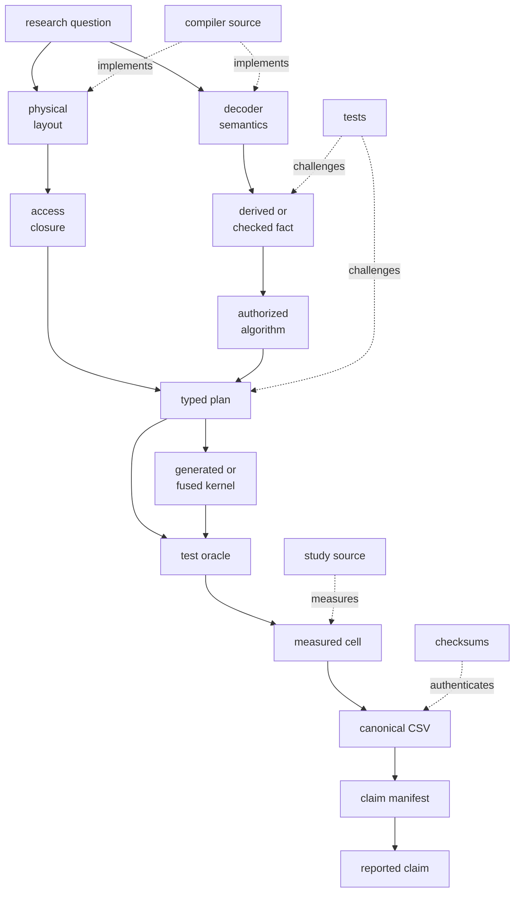

# Architecture

## Claim-bearing path

The public artifact has one seven-stage pipeline:

```text
invariant census
  -> paired predicate study
  -> membership-certificate controls
  -> physical access study
  -> neutral claim manifest
  -> generated worked example
  -> provenance and checksums
```

Every displayed value in `experiments/results/claim_manifest.csv` is derived
from canonical CSV evidence. `reproduce.sh` runs the complete claim-bearing
path. The access-compiler and crossover measurements are diagnostic branches;
`make diagnostics` regenerates them, and no manifest cell depends on them.

## Traceability graph

The repository is organized as a directed evidence graph. The manuscript is
a selected view of that graph, not the source of truth for it. Quantitative
claims terminate at manifest cells; mechanism claims point to implementation
and test oracles.



An edge has one job: derive, authorize, execute, challenge, measure, or render.
Keeping those roles separate makes it possible to replace a corpus, add a
codec primitive, or reject a claim without rewriting unrelated layers.

## Core data flow

```text
InputColumn + Recipe
        |
        v
      encode
        |
        +--> Decoder IR --------+
        +--> Layout IR ---------+--> derive_invariants
        +--> SerializedPage ----+          |
                                             v
Query -------------------------------> compile Plan IR
                                             |
                  +--------------------------+-------------------+
                  |                          |                   |
                  v                          v                   v
          generated Rust              fused fallback      candidate control
                  |                          |             + refinement
                  +-------------> ReadSession <-----------------+
                                      |
                         logical/delivered/transferred bytes
```

## Decoder IR

`src/access_compiler/decoder.rs` describes logical reconstruction as a
topologically ordered node arena:

- `BitUnpack(stream, width, miniblock layout)`
- `For(base, values)`
- `Delta(deltas, restarts, coding)`
- `Dictionary(ids, sorted unique table)`
- `Rle(values, lengths, run index)`
- `Patch(values, positions, position index, exceptions)`
- `Nullable(validity, rank index, compact values)`

`Recipe::Frame` changes physical placement without adding a logical decoder
node. It places child fields in one Zstd frame.

## Layout IR and serialized page

`layout.rs` represents fields, direct or framed locations, read granularities,
and dependency rules:

- `DependentField`: requesting a field also requires its prerequisite;
- `IndexedStream`: requested data blocks require matching index entries;
- `Restart`: a delta span expands to its preceding restart and anchor.

`LayoutIr::closure` computes the least fixed point of those dependencies and
then maps logical spans to delivered physical ranges. A framed field maps to
the entire compressed frame.

`format.rs` writes `ACPAGE01` version 3. Its header contains field, frame, and
dependency directories plus checked-invariant flags and a descriptor
checksum. Parse validates canonical IDs, offsets, lengths, alignment,
dependencies, flags, and checksum before exposing facts.

## Invariant calculus

`invariants.rs` derives typed facts bottom-up in three scopes:

| Scope | Examples | Use |
|---|---|---|
| value | non-decreasing, piecewise non-decreasing, null placement | algorithm authorization |
| mapping | order preserving, injective, affine shift | predicate translation |
| access | restart/run/patch/rank prerequisites, frame boundaries | byte closure |

Every fact carries evidence:

- `Structural`: the encoding cannot represent a violation;
- `CheckedDescriptor`: the encoder checked and authenticated the fact;
- `Layout`: the serialized dependency graph entails it.

It also carries assumptions such as checked arithmetic or a sorted unique
dictionary. Facts pass through a parent only when the parent preserves the
relevant property.

Unsigned delta is the key precision example. One restart segment structurally
proves global monotonicity. Multiple independent restart anchors prove only
piecewise monotonicity unless the descriptor separately certifies ordered
seams. The generated piecewise operator performs independent exact binary
searches inside each block; it does not use nonexistent block bounds.

## Plan IR

`compiler.rs` emits `PlanIr` nodes containing:

```text
operation
row domain
required fields
byte closure: exact or runtime-refined
output guarantee
```

Important operations include `SearchMonotone`,
`SearchPiecewiseMonotone`, `TranslateDictionaryRange`, `SeekRestart`,
`RefineCandidates`, `AggregateEncoded`, and `FusedDecodeQuery`.

Closures are marked `RuntimeRefined` when IDs, ranks, runs, patches, or search
probes determine later fields at runtime. The compiler does not print a false
static byte count for those paths.

Output guarantees are `ExactScalar`, `ExactBitmap`, `CandidateBitmap`,
`MaterializedValues`, or `FallbackRequired`.

## Generated execution and controls

`codegen.rs` specializes decoder compositions into Rust functions. It removes
recursive decoder dispatch while preserving checked arithmetic and field
access through `ReadSession`. Generated source embeds:

- the exact source fingerprint;
- one Plan IR signature per case;
- GET, SUM, BETWEEN, FILTER, selected-range SUM, fused, materialized, and
  handwritten-static registries.

The study compares:

1. full decode and materialize;
2. fused full-stream decode;
3. interpreted semantics;
4. generated execution with closure disabled;
5. generated selective execution;
6. handwritten static composition.

`static_baseline.rs` supplies the handwritten control. `interpreter.rs` is a
semantic baseline, not the optimized Plan IR executor.

## Runtime byte accounting

`runtime.rs` records:

- logical bytes requested from fields;
- delivered byte ranges after granularity and frames;
- transferred ranges after overlap/cache reuse;
- transfer operations;
- decoded frames;
- primitive values read.

A `ReadSession` can read from resident page bytes, a larger mapped byte bundle,
or a real file using positioned reads. `schedule.rs` coalesces cross-page
ranges for storage-aware execution.

## Membership certificates

`certificates.rs` implements block Bloom filters, block min/max, and sparse
fences as experimental controls. They are not silently embedded in every page.

- Bloom miss: exact empty result.
- Bloom hit: candidate blocks requiring refinement.
- min/max exclusion: exact block rejection.
- min/max overlap: candidate block.
- sparse fence: sorted-data candidate interval.

The certificate experiment reports metadata bytes, candidate fraction,
modeled bytes, latency, and source-bootstrap intervals.

## Experiment modules

| Module/binary | Responsibility |
|---|---|
| `invariant_census` | fact incidence, evidence classes, byte premiums |
| `predicate_pipeline` | complete predicate-to-SUM queries and Parquet references |
| `certificate_study` | Bloom/min-max/fence controls |
| `real_access` | selected layouts, bundles, storage read schedules |
| `claim_manifest` | source statistics, bootstrap CIs, exact displayed values |
| `documentation_example` | deterministic worked example and drift-checked artifacts |

`WITNESS_MAX_ROWS` controls the predicate/access row cap and must be at least
1,024. The canonical run uses 131,072 rows; the paired scale run uses 16,384.

## Extending the calculus

The rule set is frozen by content hash. `primitive_rule_fingerprint()`
(`src/access_compiler/heldout.rs`) is an FNV-1a hash over the concatenated
**source text** of twelve files:

```
decoder.rs  invariants.rs  layout.rs     plan.rs
encode.rs   format.rs      runtime.rs    support.rs
interpreter.rs  compiler.rs  codegen.rs  static_baseline.rs
```

Any edit to those files changes the fingerprint, including a comment, a
rename, or a new `pub` item that nothing calls. The fingerprint is recorded
next to every measurement, so a changed value invalidates the committed
generated kernels and the study aborts at its first gate until they are
regenerated. This is deliberate: it is what lets the paper claim held-out
compositions exercise frozen rules rather than result-specific kernels.

To add a codec, expect to touch `Recipe` (`encode.rs`), `DecoderNode`
(`decoder.rs`), a derivation rule (`invariants.rs`), layout and closure
(`layout.rs`), planning (`compiler.rs`, `plan.rs`), and both execution tiers
(`interpreter.rs`, `codegen.rs`). Then:

```
make walkthrough     # regenerate kernels and worked example
make test            # authorization, containment, and drift gates
./reproduce.sh       # only if a claim-bearing number should move
```

A new derivation rule must satisfy the containment contract
`C_derived ⊆ C_true`: `tests/invariant_calculus.rs` rejects a plan whose cited
fact does not entail it, and the census re-checks every derived order fact
against decoded values. Work that does **not** touch the calculus -- new
studies, reports, or claims -- belongs in `src/experiment/` or `src/bin/`,
which are outside the hashed set and therefore leave the kernels alone.

## Source maps

- [Crate flow](../src/README.md)
- [Access compiler](../src/access_compiler/README.md)
- [Study binaries](../src/bin/README.md)
- [Access crossover study](../src/bin/access_crossover/README.md)
- [Predicate pipeline study](../src/bin/predicate_pipeline/README.md)
- [Real access study](../src/bin/real_access/README.md)
- [Experiment library](../src/experiment/README.md)
- [Invariant census](../src/experiment/invariant_census/README.md)
