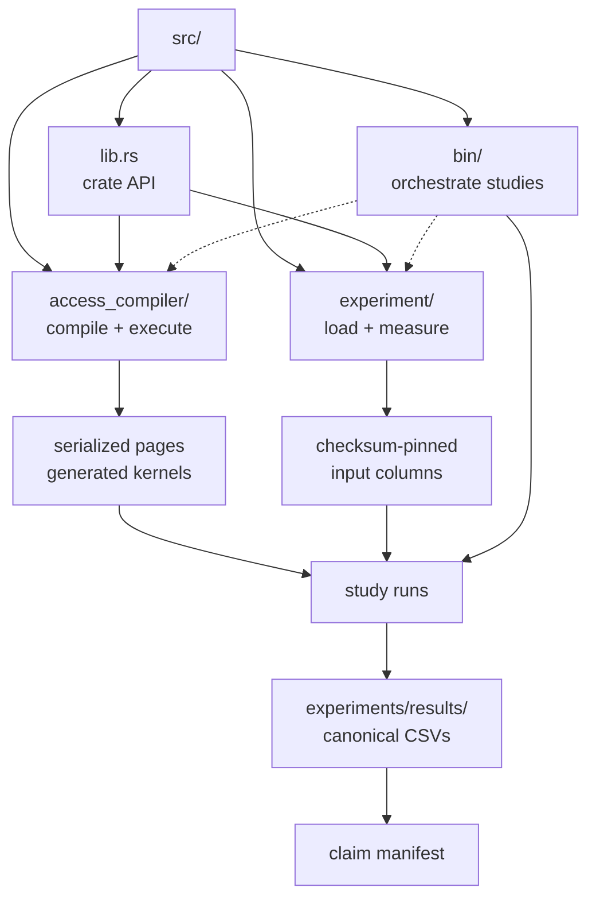

# Source Flow

```mermaid
flowchart TD
    SRC["src/"] --> LIB["lib.rs<br/>crate API"]
    SRC --> CORE["access_compiler/<br/>compile + execute"]
    SRC --> EXP["experiment/<br/>load + measure"]
    SRC --> BIN["bin/<br/>orchestrate studies"]

    LIB --> CORE
    LIB --> EXP
    BIN -.-> CORE
    BIN -.-> EXP

    CORE --> PAGES["serialized pages<br/>generated kernels"]
    EXP --> INPUTS["checksum-pinned<br/>input columns"]
    PAGES --> RUNS["study runs"]
    INPUTS --> RUNS
    BIN --> RUNS
    RUNS --> RESULTS["experiments/results/<br/>canonical CSVs"]
    RESULTS --> MANIFEST["claim manifest"]
```
