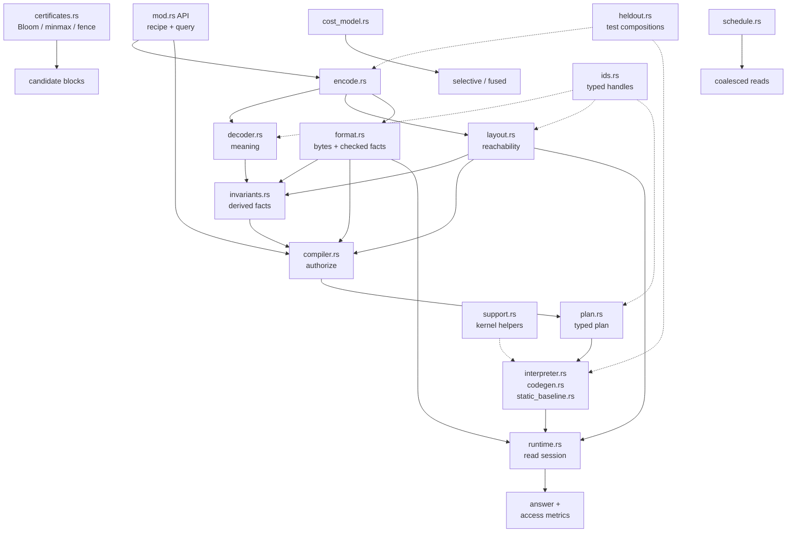

# Access Compiler Flow

- A fast plan must cite an authenticated fact; otherwise compilation falls back to scanning or decoding.
- `ByteClosure` separates logical, delivered, and transferred bytes.
- `Static` in `static_baseline.rs` means Rust type-level monomorphization,
  not a fixed query or access range.
