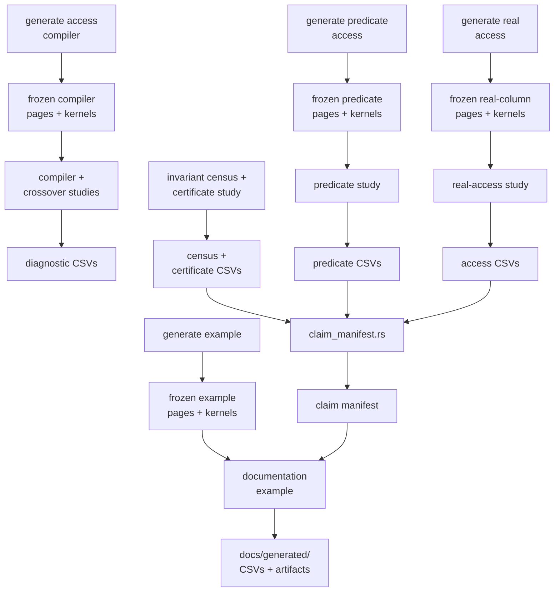

# Binary Pipeline

```mermaid
flowchart TD
    GAC["generate access<br/>compiler"] --> ACK["frozen compiler<br/>pages + kernels"]
    ACK --> ACS["compiler +<br/>crossover studies"]
    ACS --> DIAG["diagnostic CSVs"]

    GPR["generate predicate<br/>access"] --> PRK["frozen predicate<br/>pages + kernels"]
    PRK --> PPS["predicate study"]
    PPS --> PRED["predicate CSVs"]

    GRE["generate real<br/>access"] --> REK["frozen real-column<br/>pages + kernels"]
    REK --> RAS["real-access study"]
    RAS --> ACCESS["access CSVs"]

    CHECKS["invariant census +<br/>certificate study"] --> EVIDENCE["census +<br/>certificate CSVs"]

    EVIDENCE --> CLAIM["claim_manifest.rs"]
    PRED --> CLAIM
    ACCESS --> CLAIM
    CLAIM --> CM["claim manifest"]

    GDE["generate example"] --> DEX["frozen example<br/>pages + kernels"]
    DEX --> DOC["documentation<br/>example"]
    CM --> DOC
    DOC --> OUT["docs/generated/<br/>CSVs + artifacts"]
```

- Generator binaries freeze Rust kernels before the corresponding study binary runs.
- Reusable semantics live in the library; binaries orchestrate measurements and outputs.
