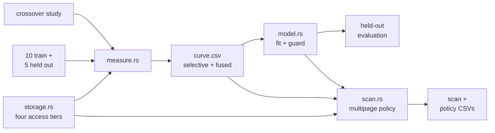

# Access Crossover Study

```mermaid
flowchart LR
    ENTRY["crossover study"] --> MEASURE["measure.rs"]
    CASES["10 train +<br/>5 held out"] --> MEASURE
    STORAGE["storage.rs<br/>four access tiers"] --> MEASURE
    MEASURE --> CURVE["curve.csv<br/>selective + fused"]
    CURVE --> MODEL["model.rs<br/>fit + guard"]
    MODEL --> EVAL["held-out<br/>evaluation"]
    CURVE --> SCAN["scan.rs<br/>multipage policy"]
    MODEL --> SCAN
    STORAGE --> SCAN
    SCAN --> OUT["scan +<br/>policy CSVs"]
```

- Cases `0..9` fit the model; cases `10..14` are held out.
- The oracle is reported as a bound, not an executable policy.
