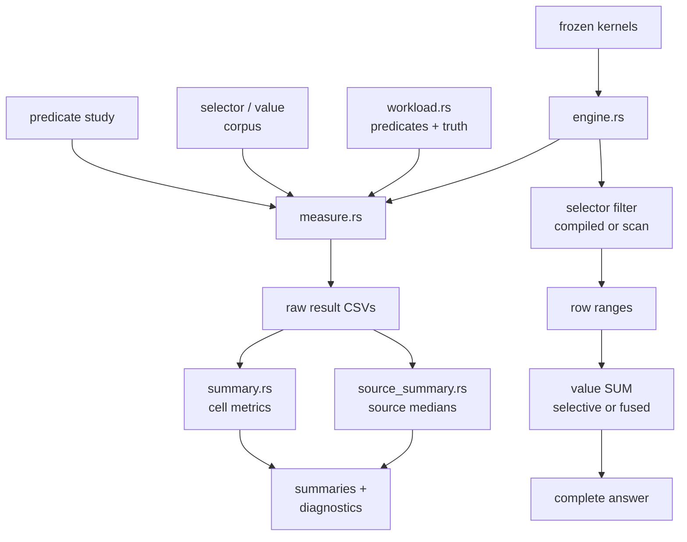

# Predicate Pipeline Study

- Every measured query is checked against `workload.rs` truth before timing is retained.
- Selector discovery and value aggregation are measured separately and end to end.
