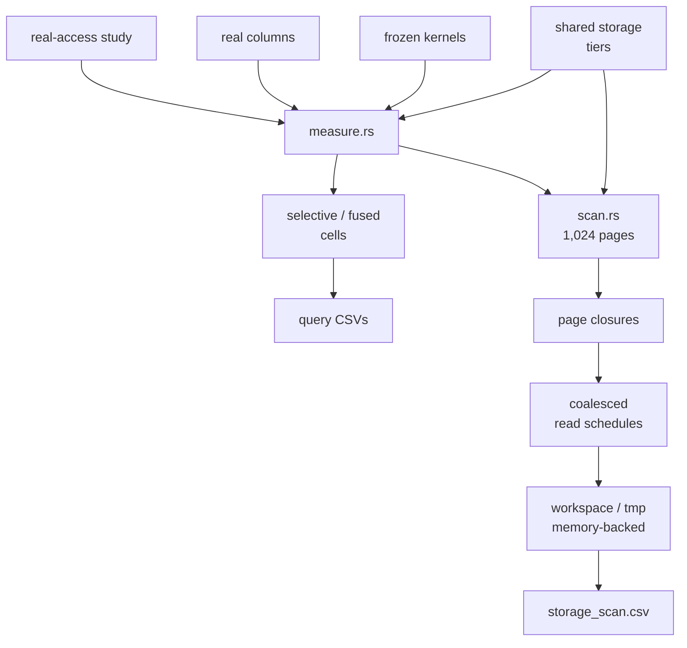

# Real Access Study

- `storage.rs` is intentionally shared with the crossover study through an explicit path import.
- Scan answers must match across every access order, storage tier, and coalescing policy.
