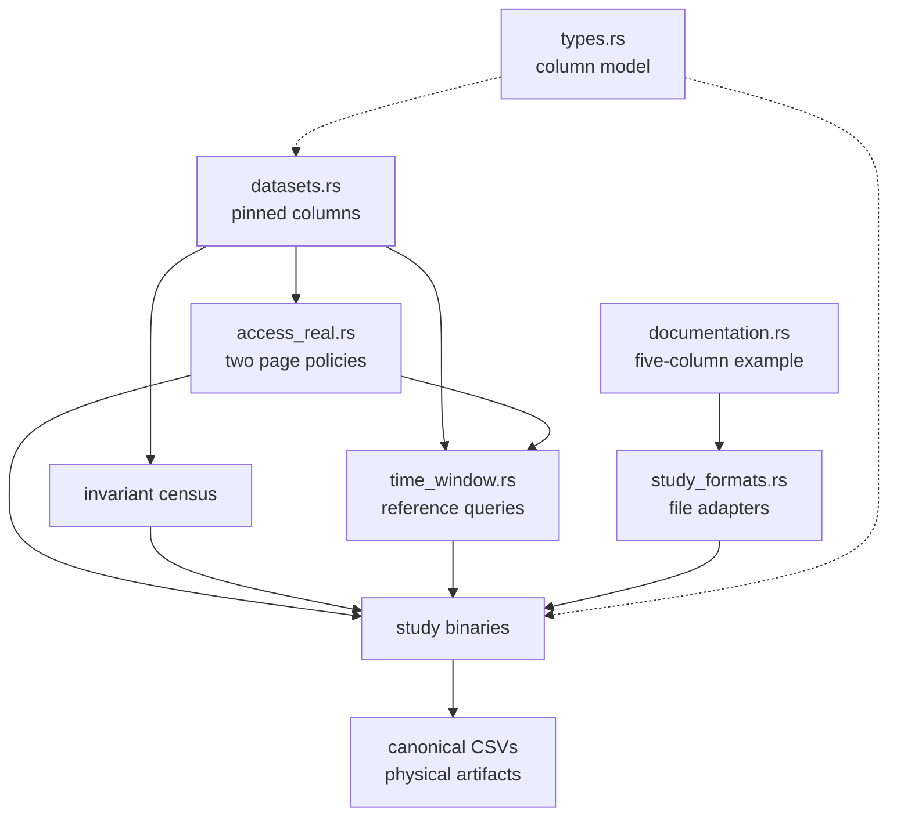

# Experiment Library

- Dataset bytes are fetched outside `src/` and verified against `INPUTS.sha256`.
- This layer owns corpus construction and measurements; query semantics remain in `access_compiler/`.
