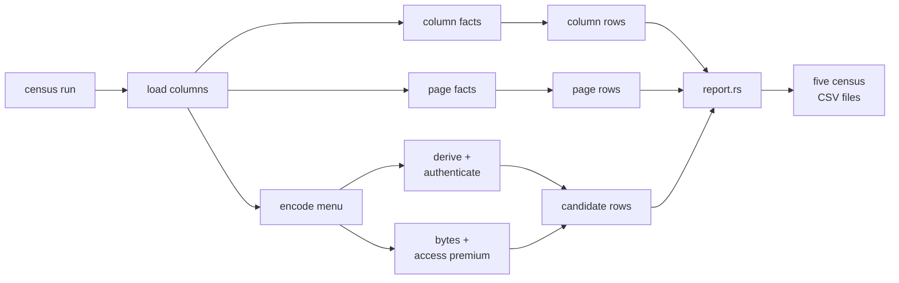

# Invariant Census Flow

```mermaid
flowchart LR
    ENTRY["census run"] --> LOAD["load columns"]
    LOAD --> VALUES["column facts"]
    LOAD --> PAGES["page facts"]
    LOAD --> CAND["encode menu"]

    CAND --> DERIVE["derive +<br/>authenticate"]
    CAND --> COST["bytes +<br/>access premium"]
    VALUES --> ROWS["column rows"]
    PAGES --> PROWS["page rows"]
    DERIVE --> CROWS["candidate rows"]
    COST --> CROWS

    ROWS --> REPORT["report.rs"]
    PROWS --> REPORT
    CROWS --> REPORT
    REPORT --> CSV["five census<br/>CSV files"]
```

- Every column is evaluated against the same complete recipe menu.
- Source-level rows prevent many correlated columns from masquerading as independent evidence.
